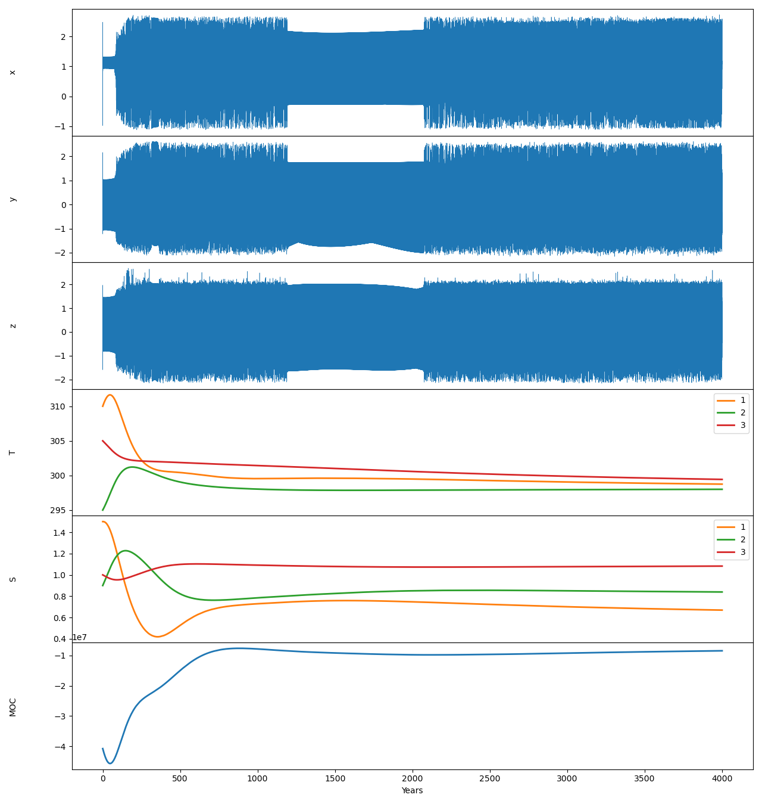

## Requirements

Prerequisite: python 3.9. Then, do `pip install DAPPER==1.3.0`

Run script with:

    python __init__.py

If your matplotlib install comes with an interactive frontend,
then the plot should show (and be zoomable) automatically.
Alternatively, it can be viewed in `time_series.pdf`.

The current resulting output is shown here

